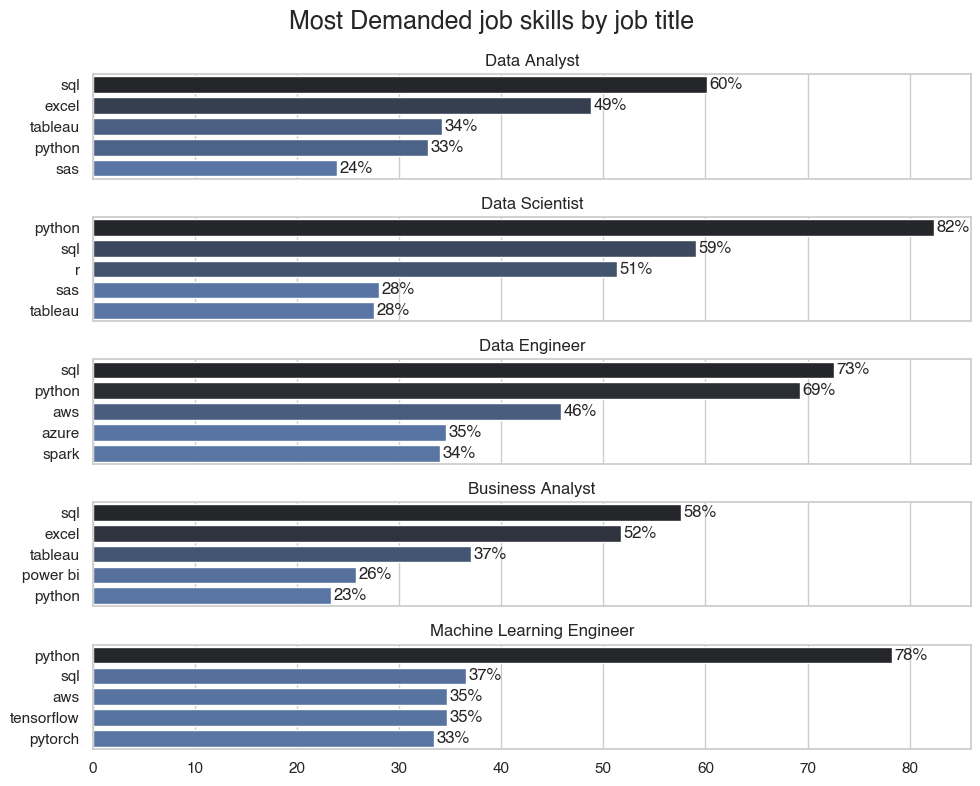
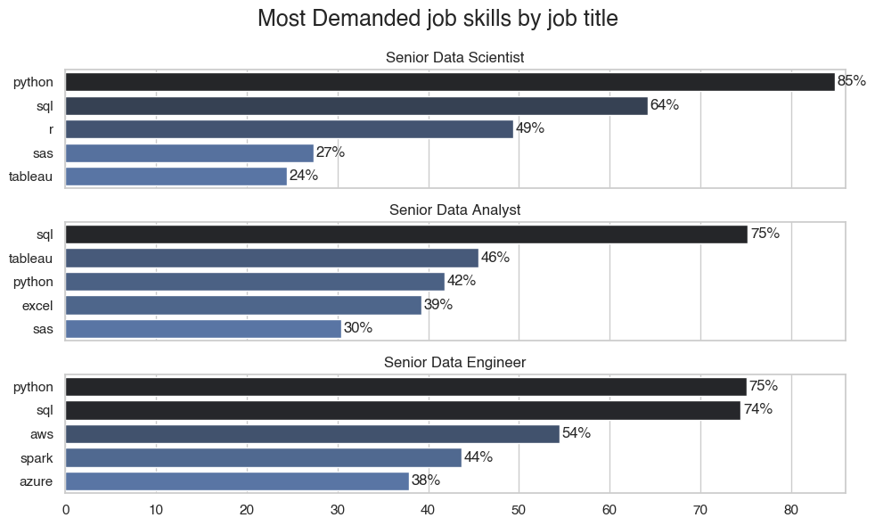

# Data Professionals Job Market Insights

## Overview

This project explores the US job posting market for data professionals (2023) using a dataset imported from the Hugging Face dataset `lukebarousse/data_jobs`. The analysis uses Python (Pandas, Matplotlib, Seaborn) to perform data preparation, exploratory data analysis, skills and salary analysis, and to recommend an optimal skill-set for different data roles.

## About dataset

Dataset source: https://huggingface.co/datasets/lukebarousse/data_jobs — job posting data for 2023 (US job postings subset was used). The dataset contains job titles, company, location, job posting date, salary information (when present), job attributes, and lists of skills/requirements extracted from postings.

## Tools I used

- **Pandas** – Data manipulation and analysis  
- **Matplotlib** and **Seaborn** – Data visualization  
- **Jupyter Notebook** – Writing and running Python scripts  
- **Git** and **GitHub** – Version control and collaboration


## The questions

The project answers the following questions:
1. What are the skills most in demand for different data roles?
2. How well do jobs and skills pay for different data roles?
3. How are salaries distributed across job titles and locations?
4. What are the most optimal skill-sets to target for someone entering the data job market?

## Data preparation and cleaning

This notebook handles the initial data ingestion, profiling, and cleaning. The primary objectives are to load the raw data from Hugging Face, inspect and correct key columns, filter the dataset to a relevant scope (US-based, full-time data jobs), and strategically impute missing data before exporting the cleaned file.

View my notebook with detailed steps here:
[2_ Skill_Demand.ipynb](1_Data_Prep_and_Cleaning.ipynb)

### Importing Files

Standard data analysis libraries (Pandas, Matplotlib, Seaborn) were imported. The ast library was included for parsing string-based lists, and datasets was used to load the data directly from the Hugging Face hub.

``` python
import pandas as pd
import matplotlib.pyplot as plt
import seaborn as sns
import ast
from datasets import load_dataset

# importing dataset
dataset = load_dataset("lukebarousse/data_jobs")['train'].to_pandas()
```

### Data Cleaning

The data cleaning process involved several key steps. First, job_posted_date was converted to a datetime object, and the job_skills column, which was stored as a string, was parsed into a list. Redundant columns were dropped.

``` python
# data parsing
df['job_posted_date'] = pd.to_datetime(df.job_posted_date).dt.date
df['job_skills'] = df['job_skills'].apply(lambda skills: ast.literal_eval(skills) if pd.notna(skills) else skills)

# droping unnessary columns
df.drop(columns=
        ['job_type_skills', 'salary_hour_avg', 'salary_rate', 'search_location'], 
        inplace=True
)
df.head()
```

The dataset was then filtered to focus the analysis on "United States" job postings and "Full-time" roles. Finally, non-data-focused roles were excluded to refine the dataset to the target job titles.

``` python
# Focusing on US market only
df_US = df[df.job_country == 'United States'].copy()
df_US.sample()

# Focusing only on full time roles
df_US.job_schedule_type.value_counts().head()
df_US_filtered = df_US[df_US.job_schedule_type == 'Full-time'].copy()
df_US_filtered.job_schedule_type.count()

# Removing none data jobs
non_data_job = ['Cloud Engineer', 'Software Engineer']
df_US_filtered = df_US_filtered.drop(df_US_filtered[df_US_filtered['job_title_short'].isin(non_data_job)].index)

# sorting and reindex filtered datasets
df_US_filtered.sort_values(by='job_posted_date', ascending=True, inplace=True)
df_US_filtered.reset_index(inplace=True, drop=True)
```

### Filling out NA Values

A significant portion of salary_year_avg values were missing. These were imputed using a hierarchical median strategy to ensure statistical reliability.

A custom function fills missing salaries using a location-aware median approach. It first uses the median salary within each (job_location, job_title_short) group—only if that group has 10 or more valid records. Otherwise, it defaults to the overall median for that job title, ensuring accurate yet reliable imputation even for sparse data.

``` python
median_salaries = df_US_known.groupby('job_title_short')['salary_year_avg'].median()

# Step 1: finding medians by (job_location, job_title_short)
loc_title_medians = (
    df_US_known.groupby(['job_location', 'job_title_short'])
    .agg({'salary_year_avg': ['median', 'count']})
)
loc_title_medians.columns = ['median_salary', 'count']
loc_title_medians.sort_values(by='count', ascending=False, inplace=True)
loc_title_medians = loc_title_medians.reset_index()


# Step 2: function to fill out missing salaries
def fill_salary(row):
    subset = loc_title_medians[
        (loc_title_medians['job_location'] == row['job_location']) &
        (loc_title_medians['job_title_short'] == row['job_title_short'])
    ]

    if not subset.empty and subset.iloc[0]['count'] >= 10:
        return subset.iloc[0]['median_salary']
    else:
        return median_salaries[row['job_title_short']]

# Step 3: keeping the origin salary column
df_US_filled['original_salary_year_avg'] = df_US_filled['salary_year_avg']

# Step 4: fill out the na values
df_US_filled['salary_year_avg'] = df_US_filled.apply(
    lambda row: fill_salary(row) if pd.isna(row['salary_year_avg']) else row['salary_year_avg'],
    axis=1
)
```

## Analysis

Each Jupyter notebooks were designed to examine distinct dimensions of the data job market to answer the questions. My approach to each is summarized below:.

### 1. What are the skills most in demand for different data roles?

To identify the most in-demand skills, I un-nested the job_skills list using explode() to analyze each skill individually. I then counted the frequency of each skill per job title and calculated its percentage share relative to the total postings for that role. This normalized data was used to plot the top 5 skills for both junior and senior positions, revealing true demand within each category.

View my notebook with detailed steps here: [3_Job_Skills_Analysis.ipynb](3_Job_Skills_Analysis.ipynb)

#### Visualize Data
```python
# plotting top 5 skills count for junior roles
fig, ax = plt.subplots(len(junior_roles), 1, figsize=(10,8), sharex=True)

for i, title in enumerate(junior_roles):
   data_series = top_skills[title]
   sns.barplot(data=data_series, x='% share', y='job_skills', ax=ax[i], hue='% share', palette='dark:b_r')

   ax[i].set_ylabel('')
   ax[i].set_title(title)
   ax[i].legend().remove()
   ax[i].set_xlabel('')
   ax[i].set_xlim(0, 86)

   for ind, v in enumerate(data_series['% share']):
      ax[i].text(v+0.25, ind, f'{round(v)}%', va='center')

fig.suptitle('Most Demanded job skills by job title', fontsize=18, fontweight='bold')
fig.tight_layout()
```
#### Output
<p align="center">
  
  
</p>


Basic EDA (`2_Basic_EDA.ipynb`)
   - Distribution of job postings by job title and company.
   - Time-based trends (if posting dates available).
   - Geographic distribution: top cities and states posting data roles.
   - Visualizations: bar charts for counts, pie charts for share, and wordclouds for common terms (if included).

2. Job Skills Analysis (`3_Job_Skills_Analysis.ipynb`)
   - Aggregated and ranked the most frequently requested skills for each job title.
   - Co-occurrence analysis of skills to find common skill pairs and clusters.
   - Visualized top skills bar charts and skill-network heatmaps (skill co-occurrence).

3. Salary Analysis (`4_Salary_Analysis.ipynb`)
   - Cleaned and standardized salary fields, created estimated numeric salary columns.
   - Explored salary distributions by job title, experience level and location.
   - Performed comparisons (median salary) and boxplots to show salary dispersion and outliers.

4. Most Optimal Skills (`5_Most_Optimal_Skills.ipynb`)
   - Identified skill-sets that frequently co-occur in higher-paying job postings.
   - Recommended an "optimal" set of skills to learn for different data roles (e.g., Data Analyst vs Data Scientist).
   - Scored skills by frequency and by associated median salary to prioritize learning.


## Conclusion

The analysis provides practical insights into the US data job market (2023):
- Clear top job titles and companies hiring for data roles.
- A prioritized list of technical skills per role, with frequency and salary associations.
- Geographic salary and demand differences that can guide job search and relocation decisions.

## What I learned

- How to preprocess messy job posting data: parsing free-text salary ranges and skill lists.
- Techniques to explode nested lists (skills) and aggregate skill frequency by job title.
- How to derive salary estimates from textual salary mentions and compare distributions across groups.
- Ways to combine frequency and salary metrics to suggest an optimal skill priority list.

## Challenges I faced

- Inconsistent salary formats and missing salary fields — required careful parsing and conservative assumptions.
- Job title heterogeneity (same role described with many variations) — needed normalization rules.
- Extracting reliable skill tokens from free-text job descriptions and separating soft vs technical skills.
- Some job postings lacked location or experience fields which limited certain subgroup analyses.

## Repository structure

```
├── data_cleaned_jobs.csv
├── 1_Data_Prep_and_Cleaning.ipynb
├── 2_Basic_EDA.ipynb
├── 3_Job_Skills_Analysis.ipynb
├── 4_Salary_Analysis.ipynb
├── 5_Most_Optimal_Skills.ipynb
└── README.md
```

## How to reproduce

1. Clone the repository.
2. Place `data_cleaned_jobs.csv` in the repository root (or update the path in notebooks).
3. Open the notebooks in Jupyter and run the cells in order from `1_Data_Prep_and_Cleaning.ipynb` through `5_Most_Optimal_Skills.ipynb`.

## Notes / Caveats

- Salary inferences are estimates when only textual salary ranges were available — treat them as approximate.
- The dataset covers 2023 job postings — results may not reflect hiring trends beyond that period.


# To be updated soon

# Data-Professionals-Job-Market-Insights
Data-driven insights into the U.S. job market using Python (Pandas, Matplotlib, Seaborn) — analyzed 200K+ postings to reveal top-paying, high-demand skills and optimize upskilling strategies for data professionals.

# Overview

This project was done to understand the job market for data professional using Pandas, Matplotlib and Seaborn for visualization.  Through a series of Python scripts, I explore key questions such as the most demanded skills, salary distribution, and the intersection of demand and salary for different skills. We will also have look about the salary distribution of each job types.

# About datasets

The dataset was imported from hugging face (Link: https://huggingface.co/datasets/lukebarousse/data_jobs). It contains the details about job posting date, skills, salary, location and other details.

# Tools used in this project

1. Python
   a. Panadas for data manipulation and analysis
   b. Matplotlib and Seaborn for data visualization
2. VS Studio Code
3. Github

# The question we want to answer

Here are the questions I want to answer in this project:

1. What are the skills most in demand for the junior and senior data roles?
2. What are salary distribution for different data professional jobs?
3. How well do jobs and skills pay for Data Analysts? 
4. What are the optimal skills for data analysts to learn? (High Demand AND High Paying)

# Complete procedure of the project

1. Import the dataset and cleaning it
2. Basis EDA of the dataset
3. Answer the questions 
4. Insights 
5. What I learnet
6. Challenges I faced
7. Conclusion

