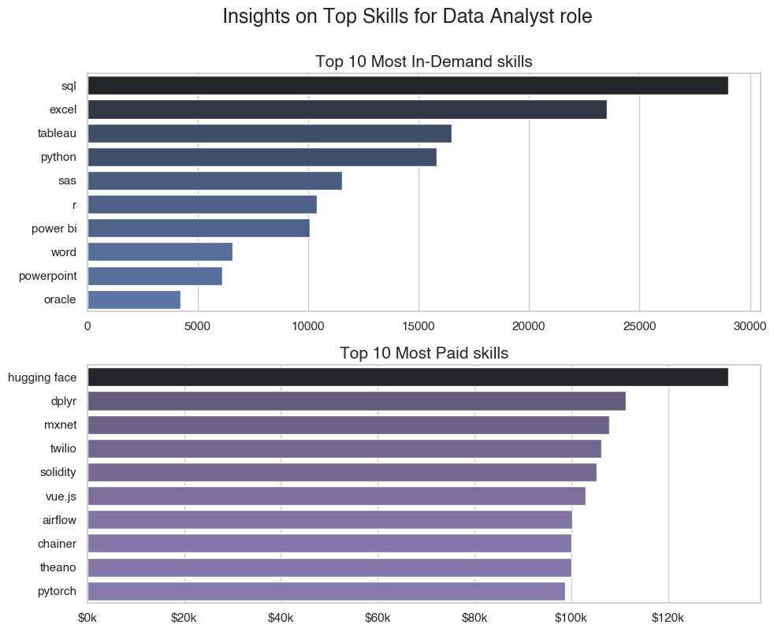
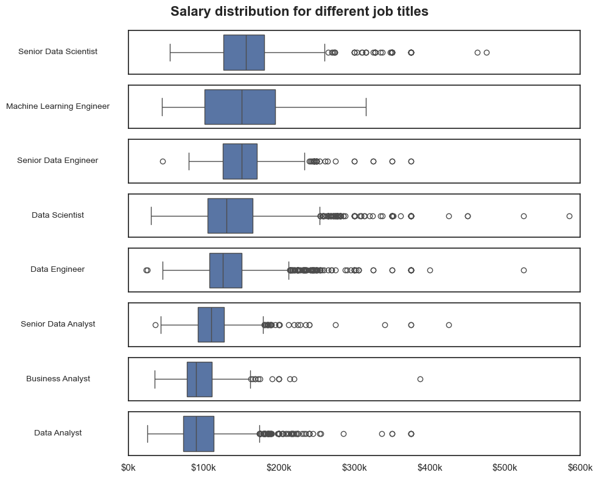
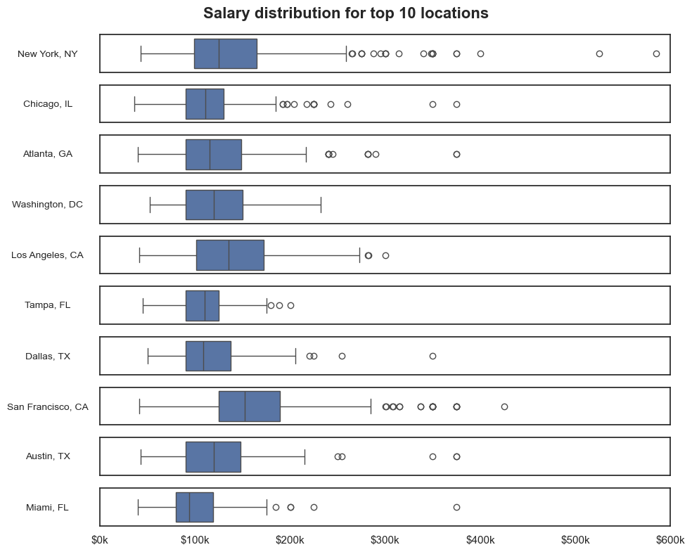
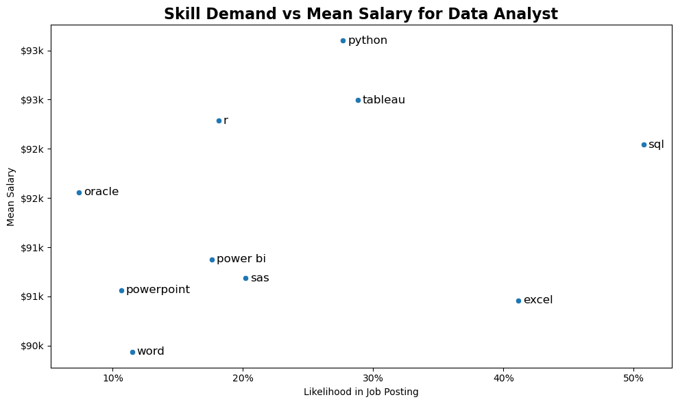

# Data Professionals Job Market Insights

## Overview

This project explores the US job posting market for data professionals (2023) using a dataset imported from the Hugging Face dataset `lukebarousse/data_jobs`. The analysis uses Python (Pandas, Matplotlib, Seaborn) to perform data preparation, exploratory data analysis, skills and salary analysis, and to recommend an optimal skill-set for different data roles.

## About dataset

Dataset source: https://huggingface.co/datasets/lukebarousse/data_jobs — job posting data for 2023 (US job postings subset was used). The dataset contains job titles, company, location, job posting date, salary information (when present), job attributes, and lists of skills/requirements extracted from postings.

## Tools I used

- **Pandas** – Data manipulation and analysis  
- **Matplotlib** and **Seaborn** – Data visualization  
- **Jupyter Notebook** – Writing and running Python scripts  
- **Git** and **GitHub** – Version control and collaboration


## The questions

The project answers the following questions:
1. What are the skills most in demand for different data roles?
2. How well do jobs and skills pay for different data roles?
3. How are salaries distributed across job titles and locations?
4. What are the most optimal skill-sets to target for someone entering the data job market?

## Data preparation and cleaning

This notebook handles the initial data ingestion, profiling, and cleaning. The primary objectives are to load the raw data from Hugging Face, inspect and correct key columns, filter the dataset to a relevant scope (US-based, full-time data jobs), and strategically impute missing data before exporting the cleaned file.

View my notebook with detailed steps here:
[2_ Skill_Demand.ipynb](1_Data_Prep_and_Cleaning.ipynb)

### Importing Files

Standard data analysis libraries (Pandas, Matplotlib, Seaborn) were imported. The ast library was included for parsing string-based lists, and datasets was used to load the data directly from the Hugging Face hub.

``` python
import pandas as pd
import matplotlib.pyplot as plt
import seaborn as sns
import ast
from datasets import load_dataset

# importing dataset
dataset = load_dataset("lukebarousse/data_jobs")['train'].to_pandas()
```

### Data Cleaning

The data cleaning process involved several key steps. First, job_posted_date was converted to a datetime object, and the job_skills column, which was stored as a string, was parsed into a list. Redundant columns were dropped.

``` python
# data parsing
df['job_posted_date'] = pd.to_datetime(df.job_posted_date).dt.date
df['job_skills'] = df['job_skills'].apply(lambda skills: ast.literal_eval(skills) if pd.notna(skills) else skills)

# droping unnessary columns
df.drop(columns=
        ['job_type_skills', 'salary_hour_avg', 'salary_rate', 'search_location'], 
        inplace=True
)
df.head()
```

The dataset was then filtered to focus the analysis on "United States" job postings and "Full-time" roles. Finally, non-data-focused roles were excluded to refine the dataset to the target job titles.

``` python
# Focusing on US market only
df_US = df[df.job_country == 'United States'].copy()
df_US.sample()

# Focusing only on full time roles
df_US.job_schedule_type.value_counts().head()
df_US_filtered = df_US[df_US.job_schedule_type == 'Full-time'].copy()
df_US_filtered.job_schedule_type.count()

# Removing none data jobs
non_data_job = ['Cloud Engineer', 'Software Engineer']
df_US_filtered = df_US_filtered.drop(df_US_filtered[df_US_filtered['job_title_short'].isin(non_data_job)].index)

# sorting and reindex filtered datasets
df_US_filtered.sort_values(by='job_posted_date', ascending=True, inplace=True)
df_US_filtered.reset_index(inplace=True, drop=True)
```

### Filling out NA Values

A significant portion of salary_year_avg values were missing. These were imputed using a hierarchical median strategy to ensure statistical reliability.

A custom function fills missing salaries using a location-aware median approach. It first uses the median salary within each (job_location, job_title_short) group—only if that group has 10 or more valid records. Otherwise, it defaults to the overall median for that job title, ensuring accurate yet reliable imputation even for sparse data.

``` python
median_salaries = df_US_known.groupby('job_title_short')['salary_year_avg'].median()

# Step 1: finding medians by (job_location, job_title_short)
loc_title_medians = (
    df_US_known.groupby(['job_location', 'job_title_short'])
    .agg({'salary_year_avg': ['median', 'count']})
)
loc_title_medians.columns = ['median_salary', 'count']
loc_title_medians.sort_values(by='count', ascending=False, inplace=True)
loc_title_medians = loc_title_medians.reset_index()


# Step 2: function to fill out missing salaries
def fill_salary(row):
    subset = loc_title_medians[
        (loc_title_medians['job_location'] == row['job_location']) &
        (loc_title_medians['job_title_short'] == row['job_title_short'])
    ]

    if not subset.empty and subset.iloc[0]['count'] >= 10:
        return subset.iloc[0]['median_salary']
    else:
        return median_salaries[row['job_title_short']]

# Step 3: keeping the origin salary column
df_US_filled['original_salary_year_avg'] = df_US_filled['salary_year_avg']

# Step 4: fill out the na values
df_US_filled['salary_year_avg'] = df_US_filled.apply(
    lambda row: fill_salary(row) if pd.isna(row['salary_year_avg']) else row['salary_year_avg'],
    axis=1
)
```

## Analysis

Each Jupyter notebooks were designed to examine distinct dimensions of the data job market to answer the questions. My approach to each is summarized below:.

### 1. What are the skills most in demand for different data roles?

To identify the most in-demand skills, I un-nested the job_skills list using explode() to analyze each skill individually. I then counted the frequency of each skill per job title and calculated its percentage share relative to the total postings for that role. This normalized data was used to plot the top 5 skills for both junior and senior positions, revealing true demand within each category.

View my notebook with detailed steps here: [3_Job_Skills_Analysis.ipynb](3_Job_Skills_Analysis.ipynb)

#### Visualize Data
```python
# plotting top 5 skills count for junior roles
fig, ax = plt.subplots(len(junior_roles), 1, figsize=(10,8), sharex=True)

for i, title in enumerate(junior_roles):
   data_series = top_skills[title]
   sns.barplot(data=data_series, x='% share', y='job_skills', ax=ax[i], hue='% share', palette='dark:b_r')

   ax[i].set_ylabel('')
   ax[i].set_title(title)
   ax[i].legend().remove()
   ax[i].set_xlabel('')
   ax[i].set_xlim(0, 86)

   for ind, v in enumerate(data_series['% share']):
      ax[i].text(v+0.25, ind, f'{round(v)}%', va='center')

fig.suptitle('Most Demanded job skills by job title', fontsize=18, fontweight='bold')
fig.tight_layout()
```
#### Output
<table align="center">
  <tr>
    <td align="center" width="50%">
      
      <br><b>For Junior Roles</b>
    </td>
    <td align="center" width="50%">
      
      <br><b>For Senior Roles</b>
    </td>
  </tr>
</table>

#### Insights

- Core Skills: SQL and Python are the universal requirements. SQL is a top-2 skill for all roles except Machine Learning Engineer (where it's #3). Python is the #1 skill for all Scientist and ML Engineer roles and #2 for Data Engineers.

- Analyst Roles (Data/Business): These roles are defined by business intelligence tools. Excel and Tableau are critical, appearing in the top 3, which is unique compared to other roles.

- Scientist & ML Roles: These are heavily programming-focused. Python is the dominant skill (75% for Data Scientist, 87% for ML Engineer). R is also a key differentiator for these positions.

- Data Engineer Roles: This role is a hybrid of programming and cloud infrastructure, defined by SQL, Python, and cloud platforms like AWS and Azure.

- Seniority vs. Junior Roles: The core skills remain largely the same regardless of seniority. Senior Data Analysts still need SQL and Excel, just as junior ones do. The primary difference is a higher demand for specialized tools and cloud skills. For example, Spark and AWS see a notable increase in demand for Senior Data Scientist and Senior Data Engineer roles, suggesting seniority is tied to system-level and cloud competency.

### 2. How well do jobs and skills pay for different data roles (eg: Data Analyst)?

To analyze skill value, I filtered the dataset for 'Data Analyst' roles. I then grouped by skill to aggregate both the total count (demand) and the mean salary (pay) for each skill. This allowed me to identify and plot the top 10 highest-paying and top 10 most in-demand skills for this specific role.

View my notebook with detailed steps here: [4_Salary_Analysis.ipynb](4_Salary_Analysis.ipynb)

``` python
Visualize Data

# Select job title for the analysis
job_role = 'Data Analyst'

# Explode the skills list column
df_filtered = df[df.job_title_short == job_role]
df_exploded = df_filtered[df_filtered.job_skills.notna()].explode('job_skills', ignore_index=True)

# Highest Paid skills
most_paid_skills = (df_exploded.groupby('job_skills')['salary_year_avg']
                    .agg(['mean', 'count'])
                    .sort_values(by='mean', ascending=False)
                    .head(10)
                   )

# Most demanded skills
most_demand_skills = (df_exploded.groupby('job_skills')['salary_year_avg']
                      .agg(['count', 'mean'])
                      .sort_values(by='count', ascending=False)
                      .head(10)
                     )

# plotting top 10 demanded skills
fig, ax = plt.subplots(2,1, figsize=(10,8))
sns.barplot(data=most_demand_skills, x='count', y=most_demand_skills.index, ax=ax[0], ...)
ax[0].set_title('Top 10 Most In-Demand skills', ...)

# plotting top 10 paid skills
sns.barplot(data=most_paid_skills, x='mean', y=most_paid_skills.index, ax=ax[1], ...)
ax[1].set_title('Top 10 Most Paid skills', ...)
```

#### Output




#### Insights

- Demand vs. Pay Trade-off: There is a clear disconnect between the most in-demand skills and the highest-paying ones. Foundational skills like SQL, Excel, and Tableau are the most requested, but they are not on the top 10 list for highest pay.

- Foundational Skills: SQL and Excel are, by a massive margin, the most demanded skills. This indicates they are the barrier to entry and are considered standard expectations for a Data Analyst, not high-value specializations.

- Niche Skills Pay More: The highest-paying skills (e.g., Hugging Face, dplyr, mxnet) are highly specialized and appeared in very few job postings. This suggests that niche expertise in advanced libraries commands a significant salary premium.

- The "Sweet Spot": Skills like Airflow and PyTorch represent a good balance. They appear in the top 10 for average salary while still having a respectable demand (counts of 325 and 86, respectively), marking them as valuable and relatively common specializations.


### 3. How are salaries distributed by Job Title and Location?

To get an accurate view of salary distributions, I used the original salary data (before imputation) to preserve the true variance.

By Job Title:
I grouped the data by job_title_short to get the median salary for each role and then sorted them from highest to lowest. Finally, I plotted box plots for each role to visualize the salary ranges, 25th/75th percentiles, medians, and outliers.

By Location:
To compare salaries geographically, I first identified the top 10 locations with the most job postings. Using the original non-imputed salary data, I plotted box plots for each of these 10 locations to compare their median salaries and pay ranges.

#### Visualize Data

``` python
# plotting salary distriubtion by job title
df_known = df[df['original_salary_year_avg'].notna()]
fig, ax = plt.subplots(len(job_titles), 1, figsize=(10, 8))

for i, job_title in enumerate(job_titles):
    temp = df_known[df_known.job_title_short == job_title]
    sns.boxplot(x='original_salary_year_avg', data=temp, ax=ax[i], orient='h')

fig.suptitle('Salary distribution for different job titles', ...)
```

``` python
# plotting salary distriubtion by job title
df_known = df_known[df_known['job_location'].notna()]
fig, ax = plt.subplots(len(job_loc), 1, figsize=(10, 8))

for i, job_loc in enumerate(job_loc):
    temp = df_known[df_known.job_location == job_loc]
    sns.boxplot(x='original_salary_year_avg', data=temp, ax=ax[i], orient='h')

fig.suptitle('Salary distribution for different job titles', ...)
```

#### Output

<table align="center">
  <tr>
    <td align="center" width="50%">
      
      <br><b>Distribution by Job Title</b>
    </td>
    <td align="center" width="50%">
      
      <br><b>Distribution by Location</b>
    </td>
  </tr>
</table>

#### Insights (by Job Title)

- Clear Pay Hierarchy: There is a distinct pay scale by role. Senior Scientist, Machine Learning Engineer, and Senior Engineer roles have the highest median salaries (all above $150k).

- Analyst vs. Scientist/Engineer: Data Scientist and Data Engineer roles form a "mid-tier" with medians around $130k-$135k. Analyst roles (Senior, Business, and Data Analyst) are at the bottom of the pay scale, with medians ranging from $90k to $110k.

- Seniority Pays: "Senior" versions of roles (Data Scientist, Data Engineer, Data Analyst) consistently have higher median salaries and a wider upper range than their non-senior counterparts.


#### Insights (by Location)

- Tech Hub Premium: Coastal tech hubs, particularly San Francisco, CA, and New York, NY, show significantly higher median salaries and a much wider upper range (interquartile range) than other locations.

- Major Market Differences: While all top 10 locations are major metro areas, cities like Atlanta, GA, and Dallas, TX, have noticeably lower median salaries and a more compressed pay range, likely reflecting a lower cost of living and different market dynamics.

- Location Matters: The data clearly shows that location is a major factor in salary, with medians for the same roles varying by tens of thousands of dollars between major cities.

### 4. What are the most optimal skills to learn?

This final analysis identifies the "most optimal" skills for a Data Analyst, defined as those that are both high in demand and high-paying.

To find this balance, I filtered the dataset for 'Data Analyst' roles and un-nested the job_skills column. I then grouped by skill to get both the job_count (demand) and mean_salary (pay) for every skill. From this, I selected the top 10 most in-demand skills and plotted their percentage share (demand) against their mean salary (pay) on a scatter plot to visualize which skills offer the best return on investment.

View my notebook with detailed steps here: [5_Most_Optimal_Skills.ipynb](5_Most_Optimal_Skills.ipynb)

#### Visualize Data

``` python
# selecting job role
job_role = 'Data Analyst'
df_filtered = df[df.job_title_short == job_role]

# exploding the skills list
df_exploded = df_filtered[df_filtered.job_skills.notna()].explode('job_skills', ignore_index=True)

df_scatter_data = (df_exploded.groupby('job_skills')
                  .agg({
                     'job_title':'count',
                     'salary_year_avg':'mean'
                  }).rename(columns={'salary_year_avg': 'mean_salary', 'job_title': 'job_count'})
                  .sort_values(by='job_count', ascending=False)
                  .head(10)
)
      
# Determine likelihood of job skill required in job posting
total_job_post = df_filtered['job_title_short'].count()
df_scatter_data['%_share'] = 100*(df_scatter_data['job_count']/total_job_post)

# plotting scatter plot
sns.scatterplot(data=df_scatter_data, x='%_share', y='mean_salary')

for i, skill in enumerate(df_scatter_data.index):
   xpoint = df_scatter_data.iloc[i,2]
   ypoint = df_scatter_data.iloc[i,1]
   plt.text(xpoint+0.35, ypoint, skill, fontsize=12, ha='left', va='center')

plt.title(f"Skill Demand vs Mean Salary for {job_role}", ...)
```

#### Output


#### Insights

The scatter plot visualizes the trade-off between a skill's demand and its average salary. The skills can be grouped into four clear quadrants:

- High Demand, Lower Pay (Bottom-Right): This quadrant is dominated by SQL, Excel, and Tableau. These are foundational skills; they are the most requested and essential for getting an entry-level job, but they do not command the highest salaries on their own.

- High Demand, High Pay (Top-Right): This is the "optimal" quadrant. Python and R are both in high demand (appearing in 18-28% of postings) and are associated with a significantly higher average salary (around $93k). This makes them the best skills to learn for maximizing job opportunities and earning potential.

- Lower Demand, Lower Pay (Bottom-Left): This group includes PowerPoint, Word, and Oracle. These skills are either general business software or more traditional database skills that are less in-demand and offer lower pay within data analysis roles compared to modern alternatives.

- Lower Demand, Higher Pay (Top-Left): SAS and Power BI sit in this area. They offer good salaries (around $91k) but are requested in fewer job postings (18-20%) than the foundational skills or Python/R. They represent valuable, specialized skill sets.


## Conclusion


## What I learned

- How to preprocess messy job posting data: parsing free-text salary ranges and skill lists.
- Techniques to explode nested lists (skills) and aggregate skill frequency by job title.
- How to derive salary estimates from textual salary mentions and compare distributions across groups.
- Ways to combine frequency and salary metrics to suggest an optimal skill priority list.

## Challenges I faced

- Inconsistent salary formats and missing salary fields — required careful parsing and conservative assumptions.
- Job title heterogeneity (same role described with many variations) — needed normalization rules.
- Extracting reliable skill tokens from free-text job descriptions and separating soft vs technical skills.
- Some job postings lacked location or experience fields which limited certain subgroup analyses.


## How to Reproduce

1. **Clone the Repository**: Clone this repository to your local machine using:  
   ```bash
   git clone https://github.com/avinashchoudhary2004/Data-Professionals-Job-Market-Insights.git
   ```
2. **Run the Notebooks files**: Run 1_Data_Prep_and_Cleaning.ipynb to generate the cleaned dataset (data_cleaned_jobs.csv). Once the cleaned data file is created, proceed to run the remaining notebooks for further analysis and visualization.

3. **Explore & Customize**: You can easily modify parameters to generate new insights. For example, in 4_Salary_Analysis.ipynb, change the job_role variable (e.g., from "Data Analyst" to "Data Scientist") and re-run the notebook to produce updated visualizations and metrics for that role.

## Notes

- The dataset covers 2023 job postings — results may not reflect hiring trends beyond that period.
- To address widespread missing salaries, nulls were imputed using the median for that specific job title and location. Treat these imputed salaries as estimates.

